# Hello World
I am Sean Liu, a M.S. computer science student at Georgia Tech, set to graduate in December 2025. I completed my bachelor's degree in Computer Science at Georgia Tech in May 2024, concentrating in artificial intelligence and information internetworks, with a minor in economics.

## About Me
[Feel free to connect with me on LinkedIn](https://www.linkedin.com/in/sliu750)

[My Resume](Sean_Liu_Resume_F25.pdf)

## Experiences

## Projects
Check out my academic and personal projects.

[Real Estate Analysis with Machine Learning](https://github.com/sliu750/ML4641-Team-Project)

[Data Visualization- Environmental Impacts of Agriculture](https://syoon029.github.io/6730-Data-Vis-Team-Project.github.io/)

Urban Treehuggers- ML-powered Analysis of Urban Forests and Air Quality
- [Check out our poster](team004poster.pdf)  
- [Project repo](https://github.com/sliu750/CSE-6242-Team-Project)

[Financial Text Analysis and Summarization](https://fintech-assignment.streamlit.app/)

## Skills
Throughout my courses and self-studying, I have gained proficiency in a variety of programming languages, frameworks, and libraries.

  
Python

  
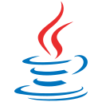Java

  
C

  
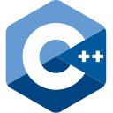C++

  
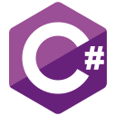C#

  
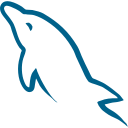MySQL

  
JavaScript

  
R

  
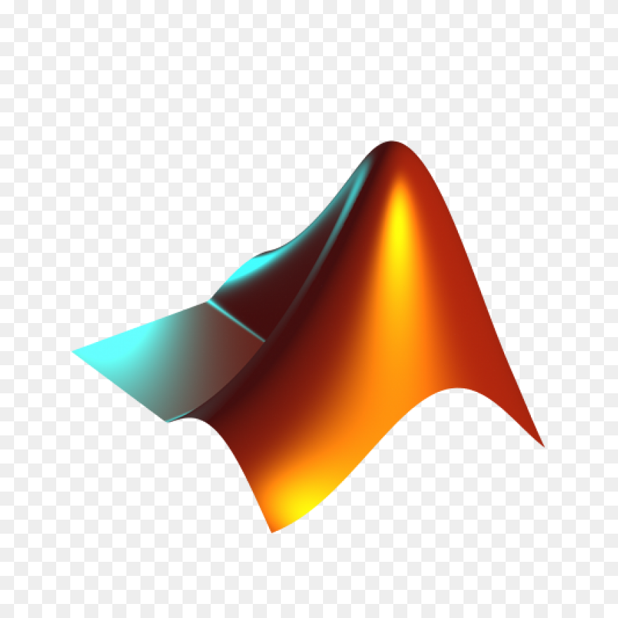MATLAB

  
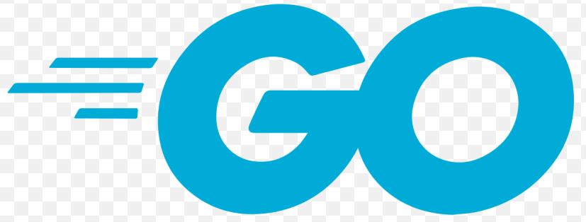Go

  
AWS

  
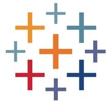Tableau

  
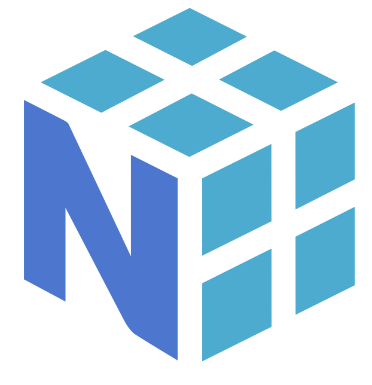NumPy

  
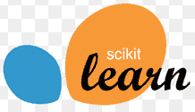sklearn

  
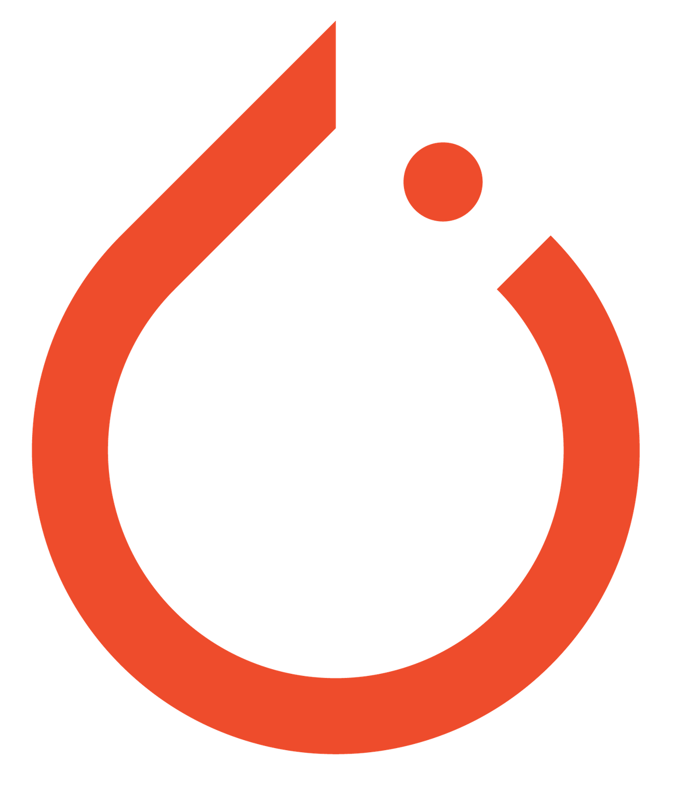PyTorch

  
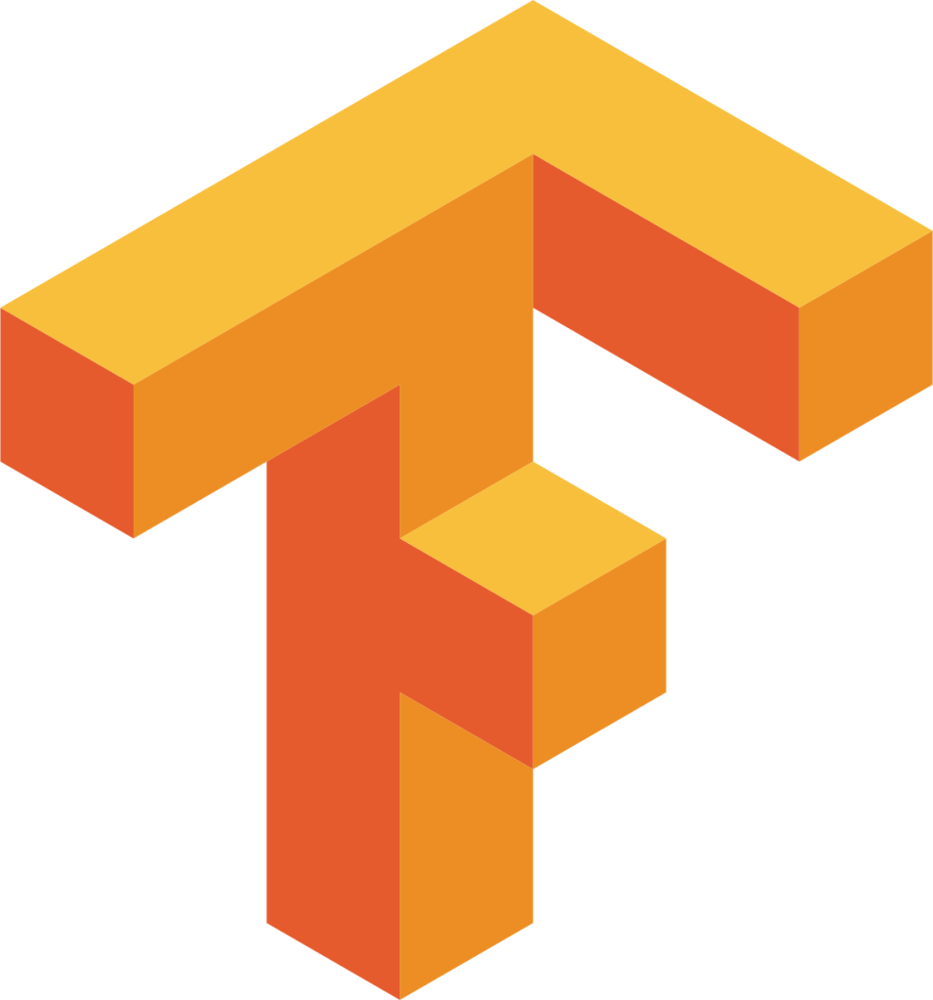TensorFlow

